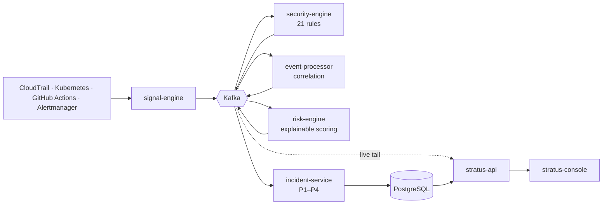

# STRATUS

**Turning Cloud Signals into Security Intelligence**

STRATUS is an event-driven platform that ingests infrastructure signals from
across a cloud estate, evaluates them against a security rule catalog,
correlates what belongs together and opens a single prioritized incident
instead of forty disconnected alerts.

Built as a TypeScript monorepo: six services on a Kafka bus, a Next.js operator
console, and the infrastructure to run all of it.

---

## Why

Cloud security tooling is loud. A deployment lands, latency degrades, a
misconfiguration appears — three different tools fire three different alerts,
and a human spends the first twenty minutes of an incident working out that
they are the same event.

STRATUS treats that correlation as the product. Signals go in; a ranked,
explained incident comes out.

```
Collect → Process → Correlate → Analyze → Prioritize → Respond
```

## Architecture



Full detail in [`docs/architecture/overview.md`](docs/architecture/overview.md),
with sequence and data-model diagrams under [`docs/diagrams`](docs/diagrams).

## Services

| Service | Port | Responsibility |
| --- | --- | --- |
| `stratus-console` | 3000 | Command Center, incident command, findings and asset views |
| `stratus-api` | 4000 | Read model, Swagger at `/docs`, SSE live stream at `/v1/stream` |
| `signal-engine` | 4010 | Collector webhooks and provider normalization |
| `event-processor` | 4020 | Sliding-window correlation across signal families |
| `security-engine` | 4030 | Rule evaluation against asset context |
| `risk-engine` | 4040 | Additive, explainable risk scoring |
| `incident-service` | 4050 | Prioritization, timeline assembly, suggested actions |

Shared code lives in `packages/`: `shared-types`, `event-contracts` (envelope,
topics, Kafka binding), `security-rules`, `config`, `observability`.

## Quickstart

Requires Node 22+, pnpm 9 and Docker.

```bash
pnpm install
cp .env.example .env

pnpm infra:up                    # Kafka, Postgres, Redis, Prometheus, Grafana, OTel
pnpm db:migrate                  # schema
pnpm --filter @stratus/api seed  # deterministic demo estate

pnpm dev                         # every service + the console
```

Then:

| What | Where |
| --- | --- |
| Command Center | http://localhost:3000 |
| API docs | http://localhost:4000/docs |
| Grafana | http://localhost:3001 (admin / stratus) |
| Prometheus | http://localhost:9090 |

Generate live traffic:

```bash
pnpm simulate -- --list
pnpm simulate -- --scenario deployment-incident
```

The `deployment-incident` scenario is the one worth watching: a deploy, a
latency regression and a new critical finding on the same service, arriving
minutes apart. The correlation engine collapses them into one P1 with a timeline
in the order things actually happened.

The console falls back to a bundled sample dataset when the API is unreachable,
so a fresh clone renders before the stack is up. Sample data is always labelled
as such in the UI.

## The rule catalog

21 rules across five categories, each with severity, remediation and control
mappings (CIS, NIST 800-53, NIST 800-190, PCI-DSS, SLSA, OWASP):

| Category | Rules | Examples |
| --- | --- | --- |
| Cloud | 5 | public bucket, publicly accessible database, `0.0.0.0/0` admin ingress, wildcard IAM, unencrypted storage |
| Kubernetes | 5 | privileged container, root container, missing resource limits, cluster-admin binding, host network |
| Container | 4 | fixable critical CVEs, `:latest` tag, unsigned image, elevated runtime capabilities |
| Secrets | 3 | plaintext credential, secret in an environment variable, secret past rotation deadline |
| CI/CD | 4 | no scanning stage, write-all token, secret printed to logs, unprotected production deploy |

Evaluation is deterministic and side-effect free, which is what makes replaying
a new rule against retained signals safe.

## Risk scoring

The score is additive and every point is attributable:

```
severity  →  × criticality × environment  →  + exposure  →  + age  →  + related findings  →  + incident history
```

Age grows logarithmically and each secondary factor is capped, so nothing
dominates. The console shows the factor breakdown next to the number. The
reasoning behind this choice — including what it gives up — is in
[ADR-0003](docs/adr/0003-explainable-risk-scoring.md).

## Tests

```bash
pnpm test        # unit
pnpm test:e2e    # Playwright, console
```

Current state of the suite, from an actual run in this repository:

```
 ✓ tests/pipeline.spec.ts                                 (3 tests)
 ✓ packages/security-rules/src/engine.spec.ts             (8 tests)
 ✓ apps/event-processor/src/correlation/engine.spec.ts    (7 tests)
 ✓ apps/risk-engine/src/scoring.spec.ts                  (13 tests)
 ✓ packages/event-contracts/src/serialization.spec.ts     (6 tests)
 ✓ apps/incident-service/src/prioritization.spec.ts       (6 tests)

 Test Files  6 passed (6)
      Tests  43 passed (43)
```

`tests/pipeline.spec.ts` is the one that matters most: it wires the real
normalizers, rule engine, correlation engine, scoring and prioritization
together in-process — no Kafka — and drives them with the same
`deployment-incident` scenario the simulator replays. If the demo stops
producing a single P1, that test fails.

The tests cover the parts where being wrong is expensive: scoring monotonicity
and bounds, correlation windowing and confidence, incident priority thresholds,
rule evaluation and isolation of a throwing rule, and contract validation with
dead-lettering.

## What has been verified

| Check | Status |
| --- | --- |
| `pnpm install` | Resolves the whole workspace; `pnpm-lock.yaml` is committed |
| `pnpm build` | All five packages, six services and the simulator compile |
| `pnpm typecheck` | Clean |
| `pnpm lint` | No errors (18 `no-explicit-any` warnings on database row mappers) |
| `pnpm test` | 43 tests across 6 files, passing |
| `next build` (console) | Compiles and prerenders all six routes |
| `pnpm test:e2e` | Written, not executed here — needs Playwright browsers |
| Live stack (Kafka, Postgres, Redis) | Not exercised here — no Docker in the build environment |

One thing to know before the first run:

- **Fonts.** The console loads IBM Plex through `next/font/google`, so the
  production build needs network access to Google Fonts. Swap it for a local
  font if you build in an air-gapped environment.

## Deployment

- **Docker** — `infrastructure/docker`: local stack plus multi-stage,
  non-root images for every service.
- **Kubernetes** — `infrastructure/kubernetes`: kustomize base and a production
  overlay. Restricted Pod Security, default-deny NetworkPolicy, read-only root
  filesystem, dropped capabilities, and an HPA that scales on consumer lag as
  well as CPU.
- **Terraform** — `infrastructure/terraform`: private VPC, MSK, encrypted RDS
  and serverless ElastiCache. Nothing in the module is publicly reachable.

## Observability

Every service exposes `/healthz`, `/readyz` and `/metrics`, exports traces over
OTLP, and logs with the active trace id attached. Prometheus alerts cover the
failure mode that matters most: the pipeline going quiet.

- `StratusConsumerLagGrowing` — detections are being delayed
- `StratusIngestionStalled` — no signals for 15 minutes
- `StratusDeadLetterSpike` — contract violations or handler failures
- `StratusRiskDegrading`, `StratusCriticalFindingsOpen` — posture regressions

A pre-provisioned Grafana dashboard for the pipeline ships in
`observability/grafana/dashboards`.

## Security

STRATUS applies its own rules to itself: signed images, pinned tags, non-root
containers, resource limits, least-privilege RBAC, no public endpoints. The
threat model and hardening checklist are in [`docs/security`](docs/security) —
including the known gaps, which is the part most projects leave out.

## Decisions

| ADR | Decision |
| --- | --- |
| [0001](docs/adr/0001-event-driven-architecture.md) | Event-driven architecture on Kafka |
| [0002](docs/adr/0002-typescript-only-stack.md) | TypeScript everywhere, no Python |
| [0003](docs/adr/0003-explainable-risk-scoring.md) | Additive, explainable risk scoring |
| [0004](docs/adr/0004-postgres-for-incidents.md) | PostgreSQL for incidents and the read model |
| [0005](docs/adr/0005-correlation-topic-extension.md) | An internal correlation topic |

## Repository layout

```
apps/          six services + the Next.js console
packages/      shared types, event contracts, rule catalog, config, observability
tools/         event simulator
infrastructure/ docker · kubernetes · terraform
observability/ prometheus · grafana · opentelemetry
docs/          architecture · diagrams · security · adr
```

## Status

Portfolio project, actively built. Authentication and multi-tenant isolation are
stubbed — `organizationId` flows through every envelope and query, but no
identity provider is wired in. That is the next thing to build.

## License

Apache 2.0 — see [LICENSE](LICENSE).
