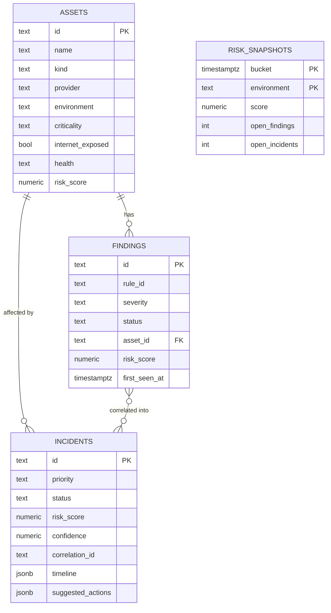

# Data model

```mermaid
erDiagram
  ASSETS ||--o{ FINDINGS : "has"
  ASSETS ||--o{ INCIDENTS : "affected by"
  FINDINGS }o--o{ INCIDENTS : "correlated into"

  ASSETS {
    text id PK
    text name
    text kind
    text provider
    text environment
    text criticality
    bool internet_exposed
    text health
    numeric risk_score
  }

  FINDINGS {
    text id PK
    text rule_id
    text severity
    text status
    text asset_id FK
    numeric risk_score
    timestamptz first_seen_at
  }

  INCIDENTS {
    text id PK
    text priority
    text status
    numeric risk_score
    numeric confidence
    text correlation_id
    jsonb timeline
    jsonb suggested_actions
  }

  RISK_SNAPSHOTS {
    timestamptz bucket PK
    text environment PK
    numeric score
    int open_findings
    int open_incidents
  }
```
